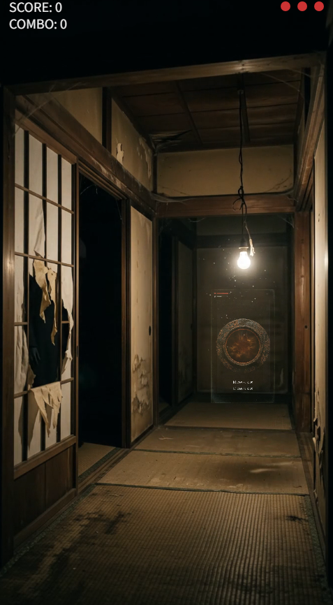

# ジャストタップ ホラー(プロトタイプ)

一瞬だけ光る印にタイミングよくタップして進む、ホラー演出のジャストタップアクションです。
HTML5 / Canvas / Vanilla JavaScriptのみで動作します(フレームワーク不使用)。



## 遊び方

- 青く光る印が出たら、すぐタップ
- 赤黒い手形が出たら、絶対にタップしない
- 取り逃してもミス扱いになる
- ミスが3回続くとゲームオーバー(女性が後ろ姿でコマ送りに近づいてくる演出が入ります)
- コンボが伸びるほど場の緊張感(BGM・SE)が変化する
- 舞台はプレイのたびにランダムで変わる(全5種類)

## 動作環境

- 現代的なブラウザ(Chrome / Safari / Edge 最新版を想定)
- スマートフォン縦画面(9:16)を基準にレイアウトしています
- 音声を伴うため、初回タップ(スタートボタン)後に音が有効になります(ブラウザの自動再生制限による仕様)

## ローカルでの動かし方

`index.html` を直接ダブルクリックで開くと、ブラウザの制限で動画が正しく読み込めない場合があります。
簡易サーバーを立てて開くことを推奨します。

```bash
# プロジェクトフォルダ内で実行(事前に assets/ フォルダを配置しておくこと。下記「素材の扱いについて」参照)
python3 -m http.server 8000
```

その後、ブラウザで `http://localhost:8000` を開いてください。

## 素材の扱いについて

`assets/` フォルダ(映像・音声素材)は `.gitignore` によりこのリポジトリの管理対象から除外しています。理由は、Publicリポジトリだと `git clone` 一つで素材一式を丸ごと持ち出せてしまうためです。コード(HTML/CSS/JS)は公開しつつ、素材だけは別経路で配信する構成にしています。

そのため、このリポジトリを clone しただけでは `assets/` フォルダは空です。以下のいずれかで用意してください。

- ローカルで動作確認する場合:手元に保管している素材一式を `assets/` フォルダにコピーする
- 本番公開する場合:GitHub Pagesではなく、Netlifyなど「Gitリポジトリと素材を分離してデプロイできるホスティング先」を利用し、コード+素材をまとめてアップロードする

## デプロイについて(重要)

**このリポジトリは GitHub Pages では正しく動作しません。** GitHub Pagesはリポジトリの中身をそのまま配信するため、`assets/` が存在しないと素材の読み込みに失敗します。

公開する場合は、Netlifyなどで「コード+素材を含めた状態のフォルダ」を直接デプロイしてください(Netlifyの手動デプロイ機能でフォルダごとドラッグ&ドロップする、またはCLIでアップロードする方法などがあります)。

## 技術構成

- 背景・タップ対象などの映像演出:`<video>` 要素 + `mix-blend-mode: screen` による黒背景の疑似透過合成
- タップ成功音/失敗音:Web Audio API によるその場合成(音声ファイル不使用)
- 起動時に全素材をプリロードし、読み込み中はローディング画面を表示

## ディレクトリ構成

```
just-tap-horror/
├── index.html
├── style.css
├── game.js
├── assets/       # 映像・音声素材
└── docs/         # README用のスクリーンショット等
```

## ライセンス

### コード(HTML / CSS / JavaScript)

本リポジトリのコード部分は [MIT License](./LICENSE) の下で公開しています。

### 素材(映像・音声)について

`assets/` 内の映像・音楽素材は、以下の生成AIツールを用いて制作しました。

- 画像生成:Nano Banana(Gemini)
- 動画生成:Gemini Omni
- BGM生成:Google Flow Music

これらの素材は無断での二次配布・転載を禁じます。動画素材には「奇妙映像ライブラリー」の透かしが入っています。

また、これらの素材はコードとは別に、各生成AIツールの利用規約にも従います。生成物の権利や商用利用可否は、利用したプラン(無料版 Gemini / Google Workspace with Gemini / Vertex AI 等)によって条件が異なります。本プロジェクトの素材を二次利用・改変・商用利用する場合は、必ず各ツールの最新の利用規約をご自身でご確認ください。

> 本READMEの記載は制作時点(2026年8月)の一般的な情報を基にしたものであり、法的助言ではありません。

## 免責事項

本作品はプロトタイプです。映像・音楽の一部はAIにより生成されています。
